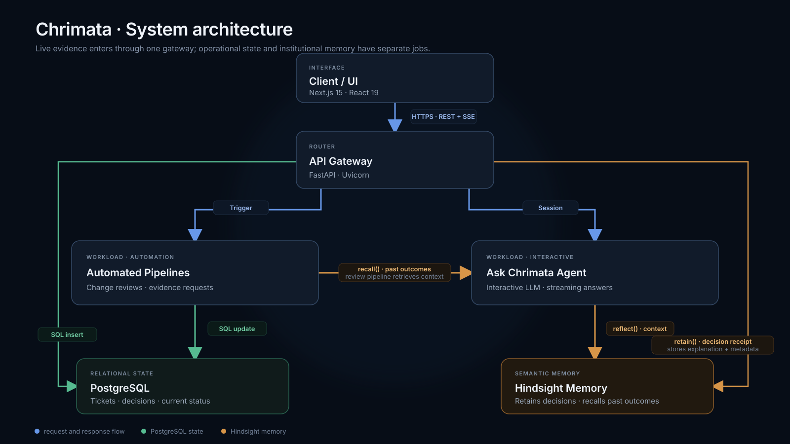
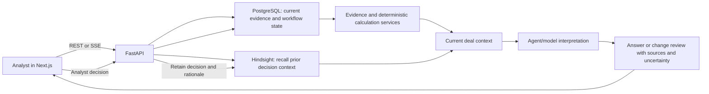

# Chrimata

**Evidence-first financial due diligence for investment teams.** Chrimata connects claims to source documents, calculates metrics deterministically, tracks open questions and analyst decisions, and uses persistent agent memory to carry context into later reviews.

This repository contains the web application, API, seeded Northstar Ops demo, Hindsight integration, architecture walkthrough, and hackathon submission materials. The demo follows a fictional company; it is not investment advice or a production diligence system.

**Team n^3t:** Niloy Nath and Nitesh Gupta

| Resource | Link |
| --- | --- |
| Project repository | [github.com/PiPlusTheta/chrimata](https://github.com/PiPlusTheta/chrimata/) |
| Demo video | [`brag-output-v2/brag_submission.mp4`](brag-output-v2/brag_submission.mp4) |
| YouTube subtitles | [`brag-output-v2/brag_submission.srt`](brag-output-v2/brag_submission.srt) |
| Architecture page | Run locally and visit [`/dashboard/architecture`](http://localhost:3000/dashboard/architecture) |
| Project article | [The agent reopened a resolved issue](https://piplustheta.in/blog/hindsight-memory-replay) |
| DEV article | [Read on DEV](https://dev.to/piplustheta/the-agent-reopened-a-resolved-issue-hindsight-remembered-why-3id2) |
| Hashnode article | [Read on Hashnode](https://piplustheta.hashnode.dev/the-agent-reopened-a-resolved-issue-hindsight-remembered-why) |

## Contents

- [What Chrimata does](#what-chrimata-does)
- [Quick start](#quick-start)
- [Configuration](#configuration)
- [System architecture](#system-architecture)
- [How Hindsight is used](#how-hindsight-is-used)
- [Walk through the demo](#walk-through-the-demo)
- [Repository map](#repository-map)
- [API overview](#api-overview)
- [Evidence and calculation model](#evidence-and-calculation-model)
- [Run checks](#run-checks)
- [Troubleshooting](#troubleshooting)
- [Limitations and production considerations](#limitations-and-production-considerations)
- [Resources and credits](#resources-and-credits)

## What Chrimata does

Financial diligence often starts with a number in a deck and ends with a trail of spreadsheets, PDFs, analyst notes, and unresolved questions. Chrimata makes that trail inspectable:

- **Evidence workspace:** view source documents and the claims extracted or entered from them.
- **Deterministic calculations:** calculate financial metrics from normalized evidence in application code, with source links and assumptions visible.
- **Issue queue:** track contradictions, missing support, and questions that need follow-up.
- **Change review:** introduce new evidence, compare it with prior state, and surface what changed.
- **Ask Chrimata:** ask questions against the current deal context and receive answers with evidence citations and uncertainty labels.
- **Decision memory:** retain analyst decisions and their reasoning with [Hindsight](https://github.com/vectorize-io/hindsight), then retrieve relevant context during later reviews.
- **Memory replay:** compare a review with memory disabled and enabled, using the same incoming evidence, to make the effect of retained context visible.

The product distinguishes **claimed**, **calculated**, **inferred**, and **conditional** information. An LLM can help interpret evidence and explain a result; it is not the arithmetic engine.

## Quick start

The local demo uses PostgreSQL, a FastAPI backend, and a Next.js frontend. Allow a few minutes for dependency installation and the first database startup.

### Requirements

- Git
- Docker Desktop or Docker Engine with the Docker Compose plugin
- Node.js **20.9 or newer** and npm
- Python **3.11 or newer** (Python 3.12 is a conservative choice)
- An [xAI API key](https://console.x.ai/) for the complete streamed Ask experience and the default Hindsight model path
- Internet access for package installation and model requests

Without an LLM provider credential, the seeded evidence workspace and deterministic calculations can still be explored, but agent answers and Hindsight-backed memory will not work fully. See [Configuration](#configuration) for supported provider options.

### 1. Get the code and start PostgreSQL

```bash
git clone https://github.com/PiPlusTheta/chrimata.git
cd chrimata
docker compose up -d db
```

Compose exposes PostgreSQL on `localhost:5432` with the local demo defaults shown in `docker-compose.yml`. Do not reuse these demo credentials for a public or production deployment.

### 2. Configure and start the backend

In a terminal from the repository root:

```bash
cd backend
python3 -m venv .venv
```

Activate the virtual environment:

```bash
# macOS / Linux (bash or zsh)
source .venv/bin/activate

# Windows PowerShell
# .venv\Scripts\Activate.ps1
```

Install Python dependencies and create your local environment file:

```bash
python -m pip install --upgrade pip
pip install -r requirements.txt
cp .env.example .env
```

On Windows, copy the file with `Copy-Item .env.example .env`. Edit `backend/.env` and replace the `XAI_API_KEY` placeholder with your own key. Keep this file local; it is ignored by Git.

Start the API:

```bash
uvicorn app.main:app --reload --port 8000
```

The API is at `http://localhost:8000`; interactive OpenAPI docs are at [`http://localhost:8000/docs`](http://localhost:8000/docs). On first launch the app creates tables and seeds the demo dataset if the database has no documents.

### 3. Configure and start the frontend

Open a second terminal at the repository root:

```bash
cd frontend
npm ci
```

The frontend defaults to the local API URL, so an environment file is optional. To make it explicit, copy the template:

```bash
cp env.example .env.local
npm run dev
```

On Windows use `Copy-Item env.example .env.local`. Open [`http://localhost:3000`](http://localhost:3000), then try the dashboard and architecture page:

- [`/dashboard`](http://localhost:3000/dashboard)
- [`/dashboard/northstar/diligence`](http://localhost:3000/dashboard/northstar/diligence)
- [`/dashboard/northstar/evidence`](http://localhost:3000/dashboard/northstar/evidence)
- [`/dashboard/northstar/queue`](http://localhost:3000/dashboard/northstar/queue)
- [`/dashboard/northstar/ask`](http://localhost:3000/dashboard/northstar/ask)
- [`/dashboard/architecture`](http://localhost:3000/dashboard/architecture)

### 4. Reset the demo data

The demo reset endpoint re-seeds the example data:

```bash
curl -X POST http://localhost:8000/api/demo/reset
```

In Windows PowerShell, use `curl.exe -X POST http://localhost:8000/api/demo/reset` to call the curl executable. Resetting removes demo state in the connected database before restoring the seed data; do not point it at a database containing data you need.

### 5. Stop local services

Stop the frontend and backend with `Ctrl+C`. Stop PostgreSQL from the repository root:

```bash
docker compose down
```

To also delete the local PostgreSQL volume and its data, run `docker compose down -v`. This is destructive to the local database contents.

## Configuration

Templates are included at [`backend/.env.example`](backend/.env.example) and [`frontend/env.example`](frontend/env.example). Copy them to the corresponding local environment files; never commit API keys or local secrets.

### Backend variables

| Variable | Required | Purpose |
| --- | --- | --- |
| `DATABASE_URL` | For non-default DB | SQLAlchemy PostgreSQL connection string. Defaults to the local Compose database. |
| `CORS_ORIGINS` | No | Comma-separated browser origins allowed by the API; defaults to `http://localhost:3000`. |
| `XAI_API_KEY` | Recommended | Enables the default xAI model path, including the streamed Ask experience and Hindsight fallback. |
| `XAI_MODEL` | No | xAI model name; defaults to `grok-3`. |
| `OPENROUTER_API_KEY` | Optional | When supplied, Hindsight uses OpenRouter before trying the xAI route. It does not replace xAI for the browser's streamed chat path. |
| `HINDSIGHT_LLM_MODEL` | Optional | Model identifier used by the OpenRouter Hindsight configuration; defaults to `openai/gpt-4o-mini`. |
| `OPENAI_API_KEY` | Optional | Enables supported non-streaming OpenAI agent calls and can be used by Hindsight if higher-priority Hindsight credentials are absent. |

The adapter can also discover provider keys supported by Hindsight, including Groq, Ollama, Gemini, Anthropic, and LM Studio. Provider support and model availability depend on the installed Hindsight version and each provider's account configuration. The easiest complete local path is an xAI key. If you set both OpenRouter and xAI keys, OpenRouter is selected for Hindsight memory while xAI remains the streamed chat provider.

### Frontend variable

| Variable | Required | Purpose |
| --- | --- | --- |
| `NEXT_PUBLIC_API_URL` | No | Browser-visible API base URL; defaults to `http://localhost:8000/api`. This is a URL, not a secret. |

`NEXT_PUBLIC_*` values are embedded in browser code. Never put credentials in frontend variables.

### Use another PostgreSQL server

Set `DATABASE_URL` in `backend/.env` to a PostgreSQL URL reachable by the backend, and update `CORS_ORIGINS` if the frontend runs on a different origin. The Docker service is only needed for the bundled local database; do not publish its demo port or credentials to the internet.

## System architecture



The diagram is also available as [PNG](submission/assets/architecture-diagram.png). The live architecture walkthrough is implemented in the app at [`/dashboard/architecture`](http://localhost:3000/dashboard/architecture). Its animated flow and simulation are included in [`architecture-workflow-simulation.gif`](submission/assets/architecture-workflow-simulation.gif) and [`architecture-workflow-simulation.mp4`](submission/assets/architecture-workflow-simulation.mp4).

### Main components

| Component | Responsibility | Data it owns or handles |
| --- | --- | --- |
| Next.js / React frontend | Evidence, issue, Ask, and architecture experiences | UI state and API requests; no provider secrets |
| FastAPI application | REST endpoints, streamed agent responses, orchestration | Request validation and application flow |
| PostgreSQL | Durable application record | Deals, documents, claims, calculations, issues, reviews, decisions, sessions, and related state |
| Evidence/calculation services | Normalize source facts and compute financial metrics | Reproducible values, assumptions, and provenance |
| Agent services | Combine current deal context with model interpretation | Answers, summaries, change-review suggestions, and citations |
| Hindsight | Recall and retain semantic decision context | Memories associated with a deal/run memory bank |

### Evidence and memory flow



PostgreSQL is the source of truth for current evidence and workflow state. Hindsight adds retrievable context about prior human decisions. Retrieved memory informs a review, but current evidence remains authoritative and should be checked when it conflicts with an older decision.

## How Hindsight is used

Chrimata integrates [Hindsight](https://github.com/vectorize-io/hindsight), an open-source memory system for AI agents. It uses the embedded Hindsight client from the backend rather than making the browser call Hindsight directly.

1. An analyst reviews evidence or resolves an issue in Chrimata.
2. Chrimata stores the review and its current state in PostgreSQL.
3. The backend prepares a decision receipt with the decision, rationale, issue context, and stable metadata.
4. The Hindsight adapter retains that receipt in a deal/run-scoped memory bank.
5. In a later session or change review, Chrimata recalls relevant memories and supplies them alongside current evidence to the agent.
6. The agent can explain why a similar issue was previously resolved and whether new evidence changes that conclusion.

Memory bank IDs are scoped from the demo run and deal (for example, `demo_{run_id}_{deal_id}`) so memories are associated with the relevant diligence context. Hindsight calls are isolated behind [`backend/app/agent/adapter.py`](backend/app/agent/adapter.py); the application can still serve evidence and deterministic calculations when no memory provider is configured, but recall will be empty and retention unavailable.

### Hindsight integration sketch

The adapter normalizes metadata before retaining a receipt and exposes asynchronous retain/recall operations. This is a simplified illustration; use the application adapter for the configured provider, bank selection, and error handling:

```python
async def retain_review(review, bank_id: str) -> bool:
    receipt = build_decision_receipt(review)
    return await hindsight_adapter.retain_review(
        bank_id=bank_id,
        document_id=receipt.document_id,
        text=receipt.text,
        meta=receipt.metadata,
    )

async def review_with_context(question: str, bank_id: str):
    memories = await hindsight_adapter.recall(
        bank_id=bank_id,
        query=question,
    )
    evidence = await load_current_evidence()
    return await agent.answer(question, evidence=evidence, memories=memories)
```

Explore [Hindsight's GitHub repository](https://github.com/vectorize-io/hindsight) and [official documentation](https://hindsight.vectorize.io/) for its memory model and provider setup.

### Memory replay

The replay endpoint runs the same incoming document through two review paths: one with memory disabled and one with it enabled. Both are non-persisting runs; the backend compares their returned review state. That makes it possible to inspect whether a prior decision changes the result without confusing a replay with a new saved review. The included demo illustrates one case, not a general benchmark or proof that memory always improves decisions.

## Walk through the demo

The seeded fictional company **Northstar Ops** gives the UI a concrete diligence story:

1. Compare a historical investor-deck ARR claim with the current operating data.
2. Inspect how active, signed-but-inactive, and unsigned pipeline revenue are treated.
3. Review open issues, assumptions, and analyst decisions.
4. Introduce later evidence and see which metrics or issues need review.
5. Ask Chrimata a question and inspect the citations and epistemic labels.
6. Replay a review with and without prior Hindsight memory to see the retained decision context in action.

The example intentionally distinguishes a reported figure from a derived one. For example, monthly recurring revenue can be annualized in deterministic code, while whether that run rate is supported by active customers depends on source evidence. The demo's answer key is in [`data/answer_key/truth_sheet.md`](data/answer_key/truth_sheet.md); seed material is in [`data/demo/`](data/demo/).

### Relevant visual assets

| Asset | What it shows |
| --- | --- |
| [`architecture-diagram.svg`](submission/assets/architecture-diagram.svg) | System components and their connections |
| [`architecture-map.png`](submission/assets/architecture-map.png) | Architecture overview image |
| [`architecture-platform-simulation.png`](submission/assets/architecture-platform-simulation.png) | Architecture simulation frame |
| [`architecture-workflow-simulation.gif`](submission/assets/architecture-workflow-simulation.gif) | Animated analyst-decision data flow |
| [`memory-replay-result.png`](submission/assets/memory-replay-result.png) | With-memory and without-memory replay result |
| [`diligence-evidence.png`](submission/assets/diligence-evidence.png) | Evidence and diligence view |
| [`decision-and-change.png`](submission/assets/decision-and-change.png) | Decision and change-review view |
| [`ask-with-context.png`](submission/assets/ask-with-context.png) | Ask experience with contextual evidence |
| [`youtube-thumbnail.png`](submission/assets/youtube-thumbnail.png) | Demo-video thumbnail |

## Repository map

```text
chrimata/
├── backend/
│   ├── app/
│   │   ├── agent/          # Agent orchestration, prompts, Hindsight adapter
│   │   ├── api/            # API routers and endpoints
│   │   ├── db/             # Database configuration and session
│   │   ├── models/         # SQLAlchemy models
│   │   ├── schemas/        # Pydantic request/response schemas
│   │   └── services/       # Evidence, calculations, reviews, and domain logic
│   ├── tests/              # Backend test suite
│   ├── .env.example        # Safe local backend configuration template
│   └── requirements.txt
├── data/
│   ├── answer_key/         # Expected demo conclusions and evidence notes
│   └── demo/               # Seeded fictional company source material
├── frontend/
│   ├── src/app/            # Next.js routes and pages
│   ├── src/components/     # Product UI, including architecture walkthrough
│   ├── src/api/            # Browser API client
│   └── env.example         # Safe local frontend configuration template
├── submission/
│   ├── assets/             # Architecture, product, replay, and video assets
│   └── *.md                # Articles, social content, and submission notes
├── brag-output-v2/         # Final demo video, voiceover, and subtitles
├── docker-compose.yml      # Local PostgreSQL service
└── README.md
```

## API overview

The full request and response schemas are available through FastAPI's interactive docs at `/docs` while the backend is running. The following route groups describe the main application surface; API routes are mounted under `/api`.

### Deals and evidence

| Method | Path | Purpose |
| --- | --- | --- |
| `GET` | `/api/deals` | List available diligence deals |
| `GET` | `/api/deals/{deal_id}/summary` | Deal summary and current metrics |
| `GET` | `/api/deals/{deal_id}/documents` | List source documents |
| `GET` | `/api/deals/{deal_id}/documents/{document_id}` | Retrieve a document and its details |
| `POST` | `/api/deals/{deal_id}/documents` | Add a document to a deal |
| `GET` | `/api/deals/{deal_id}/claims` | List deal claims |
| `GET` | `/api/claims/{claim_id}` | Retrieve claim details and provenance |
| `GET` | `/api/deals/{deal_id}/calculations` | List calculated metrics |
| `GET` | `/api/deals/{deal_id}/issues` | List diligence issues |
| `GET` | `/api/issues/{issue_id}/reviews` | List reviews for an issue |
| `GET` | `/api/reviews/{review_id}` | Retrieve a review |
| `POST` | `/api/issues/{issue_id}/reviews` | Record an issue review |
| `PATCH` | `/api/reviews/{review_id}/memory-status` | Update memory retention status |
| `GET` | `/api/deals/{deal_id}/report` | Retrieve a diligence report |
| `POST` | `/api/deals/{deal_id}/introduce-july-evidence` | Introduce the demo's later evidence |
| `POST` | `/api/demo/reset` | Reset and reseed demo data |

### Agent, change review, and decision memory

| Method | Path | Purpose |
| --- | --- | --- |
| `POST` | `/api/agent/analyze` | Analyze the current deal context |
| `POST` | `/api/agent/ask` | Ask a question against deal evidence |
| `POST` | `/api/agent/retain-review` | Retain a review decision in memory |
| `POST` | `/api/agent/new-session` | Start a fresh agent session |
| `POST` | `/api/agent/reflect` | Generate a reflection over context/memory |
| `POST` | `/api/agent/sessions` | Create a chat session |
| `GET` | `/api/agent/sessions?deal_id=...` | List sessions for a deal |
| `GET` | `/api/agent/sessions/{session_id}` | Retrieve a session and messages |
| `PATCH` | `/api/agent/sessions/{session_id}` | Update a session |
| `DELETE` | `/api/agent/sessions/{session_id}` | Delete a session |
| `POST` | `/api/agent/sessions/{session_id}/stream` | Stream an agent response using SSE |
| `POST` | `/api/change-reviews/manual` | Create a manual change review |
| `POST` | `/api/change-reviews/ai` | Create an AI-assisted change review |
| `GET` | `/api/deals/{deal_id}/change-reviews` | List change reviews for a deal |
| `GET` | `/api/change-reviews/{review_id}` | Retrieve a change review |
| `POST` | `/api/issues/{issue_id}/evidence-request` | Request evidence for an issue |
| `GET` | `/api/issues/{issue_id}/evidence-requests` | List evidence requests |
| `PATCH` | `/api/evidence-requests/{request_id}` | Update an evidence request |
| `GET` | `/api/issues/{issue_id}/decision-receipt` | Retrieve an issue decision receipt |
| `POST` | `/api/issues/{issue_id}/decision-receipt/retry-retention` | Retry retaining a decision receipt |
| `POST` | `/api/issues/{issue_id}/memory-replay` | Compare review behavior with and without memory |

Check `/docs` for the exact current parameters and schemas before integrating another client.

### Example: create a session and ask the agent

`/api/agent/ask` expects a session ID. Create a session first, then use its returned `id` as `session_id` in the ask request:

```bash
curl -X POST http://localhost:8000/api/agent/sessions \\
  -H 'Content-Type: application/json' \\
  -d '{"deal_id":"northstar"}'

# Replace SESSION_ID with the id returned by the first request.
curl -X POST http://localhost:8000/api/agent/ask \\
  -H 'Content-Type: application/json' \\
  -d '{"deal_id":"northstar","session_id":"SESSION_ID","question":"What supports the current ARR figure?"}'
```

The browser's streamed conversation uses the session SSE route. For exact payload examples, open `/docs` and inspect the generated schema.

## Evidence and calculation model

Financial calculations are implemented in [`backend/app/services/evidence.py`](backend/app/services/evidence.py) using integer paise for money and `Decimal` for ratios. Keeping arithmetic deterministic makes a result reproducible and inspectable. The agent can summarize what the result means, but should not silently replace the calculation.

A useful way to read a result is:

```text
source claim → normalized evidence → deterministic calculation → interpretation
```

For every important metric, inspect the underlying source, period, inclusion rules, and whether the displayed value is claimed, calculated, inferred, or conditional. New evidence may change the current conclusion; retained memory is context, not a substitute for checking the current record.

## Run checks

Commands are documented here for contributors; they are not required to run the app.

```bash
# Backend tests (run from backend/ with its virtual environment active)
pytest -q

# Frontend lint (run from frontend/)
npm run lint

# Frontend production build (run from frontend/)
npm run build
```

Backend tests use an isolated SQLite test setup rather than the local PostgreSQL demo database. Check the test configuration before adding integration tests that need external services.

## Troubleshooting

### PostgreSQL connection refused

Run `docker compose ps` from the repository root and confirm the `db` service is healthy/listening on port `5432`. If another local database already uses that port, change the host-side port mapping in `docker-compose.yml` and update `DATABASE_URL` to match.

### Frontend loads but API requests fail

Confirm the backend is running on port `8000`, then check `NEXT_PUBLIC_API_URL` in `frontend/.env.local`. If the frontend uses another host or port, add its full origin to `CORS_ORIGINS` in `backend/.env` and restart the backend.

### Ask or memory actions report provider errors

Check that the backend has a valid provider key in `backend/.env`, that the model is enabled for the account, and that the machine can reach the provider. Restart Uvicorn after changing environment variables. The UI and deterministic evidence calculations do not prove that model-backed calls are configured.

### Hindsight has no memories

Confirm a supported provider key is configured and that the review receipt was successfully retained. A new bank/run may not have memories yet. Memory replay is designed to make the with/without-memory state visible; an empty memory result is a valid state when nothing has been retained or retrieved.

### Python dependency installation fails

Verify the Python version, activate the backend virtual environment, and retry with a current pip. On Windows, PostgreSQL driver installation can depend on the selected Python/platform wheel; use a supported 64-bit Python release if pip cannot find a compatible wheel.

## Limitations and production considerations

- This is a hackathon/demo application with a fictional dataset, not a production financial diligence service.
- Local Compose credentials are intentionally simple and must be replaced outside local development.
- Do not expose the API, database, or demo reset endpoint publicly without authentication and appropriate access controls.
- Provider credentials belong only in backend environment configuration or a secret manager; never in frontend variables, screenshots, logs, commits, or issue reports.
- The application currently creates missing tables at startup with SQLAlchemy `create_all`; a migration framework is not configured. Add and review database migrations before evolving deployed schemas.
- Hindsight memory is contextual and probabilistic retrieval. Verify recalled reasoning against current evidence and preserve source citations in decisions.
- Model-generated explanations can be incomplete or wrong. Review calculations, citations, assumptions, and uncertainty before relying on an output.
- The memory replay is one controlled demo comparison, not a statistically valid evaluation of agent quality.

## Resources and credits

- **Hindsight source:** [Vectorize-io/Hindsight on GitHub](https://github.com/vectorize-io/hindsight)
- **Hindsight documentation:** [hindsight.vectorize.io](https://hindsight.vectorize.io/)
- **Vectorize guide to agent memory:** [What is agent memory?](https://vectorize.io/what-is-agent-memory)
- **Project source:** [PiPlusTheta/chrimata](https://github.com/PiPlusTheta/chrimata/)
- **Project write-up:** [The agent reopened a resolved issue](https://piplustheta.in/blog/hindsight-memory-replay)
- **Published on DEV:** [Read the DEV article](https://dev.to/piplustheta/the-agent-reopened-a-resolved-issue-hindsight-remembered-why-3id2)
- **Published on Hashnode:** [Read the Hashnode article](https://piplustheta.hashnode.dev/the-agent-reopened-a-resolved-issue-hindsight-remembered-why)

Built by **Niloy Nath and Nitesh Gupta** — **team n^3t**.
