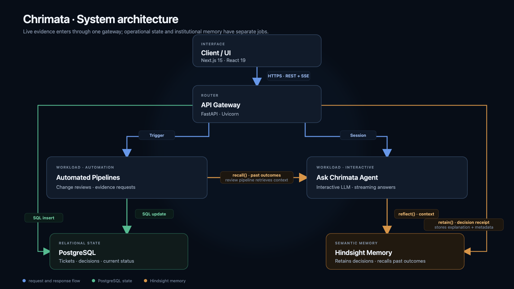

# We Replayed the Same Review With Hindsight

A memory badge is easy to add to an agent. Showing what that memory changes is harder. We wanted to see whether an earlier analyst decision would alter a later review, so we built a replay that runs the same incoming evidence through Chrimata twice: once without Hindsight recall, and once with it.

Chrimata is a financial due diligence workspace. It connects claims to source documents, tracks open review issues, and records analyst decisions. Hindsight gives its review agents a way to retrieve the reasoning behind previous decisions. The replay makes that connection visible: it puts both review results next to each other and reports the differences the server can identify.

## The problem is not remembering a status

Suppose a diligence issue has already been resolved. A new document arrives and changes a financial metric. The review agent must decide whether that change affects the old issue. Seeing only the newest numbers and current issue list can make a previously investigated question look unresolved again.

The status `resolved` is not enough context to decide what should happen next. The agent needs to know what the analyst concluded, why, which evidence supported it, and what kind of new evidence would invalidate the conclusion. We record that reasoning as a decision receipt and retain it in Hindsight so a later review can retrieve it.

We use the sample company Northstar Ops to make the scenario concrete. Its new evidence changes MRR, while an earlier issue already has a recorded resolution. The useful question is not “does the model mention memory?” It is “does the prior decision still apply, and can we inspect how the answer changes when the agent can recall it?”


## Replay the same trigger document twice

The replay service receives a run, a memory bank, and a trigger document. It calls the existing change-review pipeline twice. The first call disables memory; the second enables recall. Both set `persist=False`:

```python
without = await self.change_review_service.create_ai_review(
    db, run_id, bank_id,
    trigger_document_id=trigger_document_id,
    memory_enabled=False,
    persist=False,
)

with_mem = await self.change_review_service.create_ai_review(
    db, run_id, bank_id,
    trigger_document_id=trigger_document_id,
    memory_enabled=True,
    persist=False,
)
```

That flag matters. A comparison should not silently create two real reviews, open duplicate issues, or teach the memory store from an evaluation run. In `create_ai_review`, persistence is the gate around creating issue rows and writing a `ChangeReview`. The replay can therefore show candidate outcomes without treating them as committed analyst work.

The two runs share the same trigger document and current application context. The review pipeline computes metric changes and candidate issues before it builds the reasoning context. The memory-enabled run adds retrieved memories to that context; the no-memory run skips retrieval:

```python
memory = []
memory_texts = []
if memory_enabled:
    metrics = list({mc["metric"] for mc in comparison.metric_changes})
    issue_types = [ci["metric"] for ci in candidate_issues]
    memory = await self.memory_service.recall_for_change_review(
        bank_id,
        entity="Northstar Ops",
        metrics=metrics,
        issue_types=issue_types,
        period=trigger_doc.document_date if trigger_doc else None,
    )
    for item in memory:
        text = getattr(item, "text", "") or ""
        if text:
            memory_texts.append(text)
```

The query is grounded in the change under review: metrics, candidate issue types, entity, and document period. That gives Hindsight useful retrieval context instead of asking a broad question such as “what should I do?” The retrieved text is passed into the reasoning step alongside the current evidence and records.

## Keep the comparison outside the model

We did not ask a third LLM call to grade the two summaries. The replay service compares structured fields returned by each review. For example, it checks which issue IDs appear among unaffected issues and which appear as reopened:

```python
unaffected_without = {
    ui.get("issue_id") for ui in without.get("unaffected_issues", [])
}
unaffected_with = {
    ui.get("issue_id") for ui in with_mem.get("unaffected_issues", [])
}
reopened_without = {
    ai.get("issue_id") for ai in without.get("affected_issues", [])
    if ai.get("effect") == "reopened"
}
reopened_with = {
    ai.get("issue_id") for ai in with_mem.get("affected_issues", [])
    if ai.get("effect") == "reopened"
}
```

The service then reports cases where the no-memory result reopens an issue while the memory-enabled result leaves it resolved, as well as new-issue and summary differences. It also reports how many prior memories were returned. That count is not proof that a memory was useful; it is a clue the reviewer can inspect alongside the actual result.

This boundary is intentional. The language model interprets evidence and produces structured review output. Ordinary server code compares IDs and fields. A model can still make a bad judgment in either run, but the comparison itself does not depend on another model deciding which answer sounds better.

## What the replay showed us

In the Northstar walkthrough, the run without memory can treat the related question as new or reopen it because it sees the changed metric without the earlier rationale. With Hindsight enabled, the agent can retrieve the prior resolution; in the captured comparison, eight memories were recalled and the issue remained resolved. The replay screen makes the result concrete instead of asking the viewer to infer it from an icon or a paragraph of generated explanation.

The interesting result is not that memory always wins. It is that the previous decision becomes available for the next review. If new evidence contradicts the earlier rationale, the system should reopen the issue. A memory is context to evaluate, not an instruction to preserve the past.

That distinction affects what we retain. A decision receipt contains more than a status: it connects the issue to the analyst’s decision and explanation, the related claim, and supporting evidence references. Hindsight can then retrieve a natural-language account of why the issue was resolved. PostgreSQL remains the system of record for current ticket state and review rows; Hindsight is the retrieval layer for prior reasoning.



## What this design does and does not prove

The replay is a product-level inspection tool, not a controlled benchmark. The two calls use the same trigger document, but they are separate LLM invocations. Model variation can affect their outputs, and retrieved memories can be incomplete or irrelevant. We do not claim that adding Hindsight guarantees a better review or that the captured example generalizes to every deal.

The comparison is still useful because it exposes the proposed mechanism. A reviewer can see whether prior context was recalled, which structured issue outcomes differed, and whether the current evidence actually supports carrying the old resolution forward. If the outputs differ only in prose, that is visible too; the server reports summary changes separately from issue-state changes.

There are also practical limits to sandboxing. `persist=False` prevents the review pipeline from committing its review and issue mutations, and the memory path recalls context without retaining a new decision. The model calls still happen, so replay consumes inference time and can return different results on another run. We treat it as a way to inspect a decision, not a free or perfectly repeatable simulation.

## Lessons we are carrying forward

**Make memory effects inspectable.** A memory badge tells me that retrieval happened. A side-by-side replay helps me see whether it changed issue handling or only phrasing.

**Do not let evaluation mutate the investigation.** Both replay runs use `persist=False`; candidate outcomes remain candidates until an analyst commits a real review.

**Compare structured facts in code.** Issue IDs and state transitions are more reliable to diff deterministically than asking an LLM to rank two prose summaries.

**Treat recalled decisions as evidence about the past.** Current documents still decide whether an old conclusion holds. Memory should make the reasoning available, not make it permanent.

Building this feature changed how we think about agent memory. The useful question is not whether an agent can retrieve something from the past. It is whether that context changes a consequential next step—and whether we can inspect why. Hindsight gives Chrimata a way to carry prior reasoning into a new review; the replay gives us a way to examine that behavior before it becomes part of the investigation record.

The [Chrimata project source code](https://github.com/PiPlusTheta/chrimata/) includes the review pipeline, Hindsight adapter, and replay implementation. For the memory layer itself, see the [Hindsight GitHub repository](https://github.com/vectorize-io/hindsight), the [Hindsight documentation](https://hindsight.vectorize.io/), and Vectorize’s overview of [agent memory](https://vectorize.io/what-is-agent-memory).
