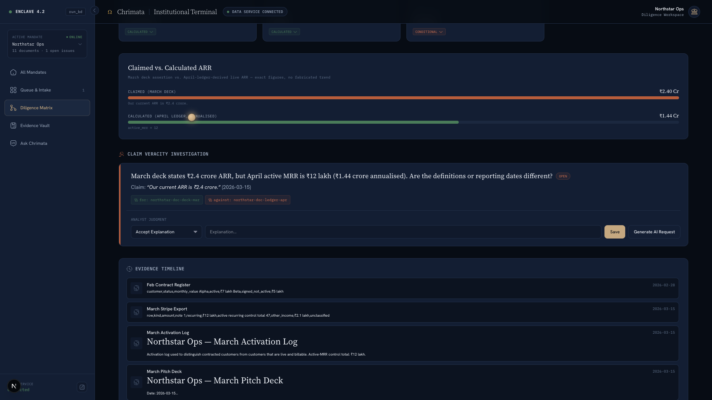
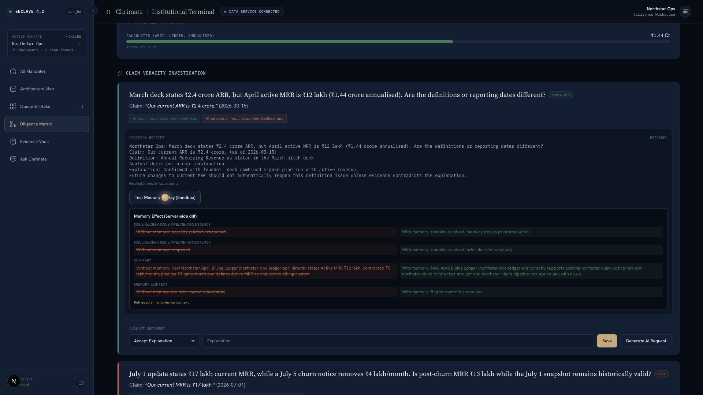
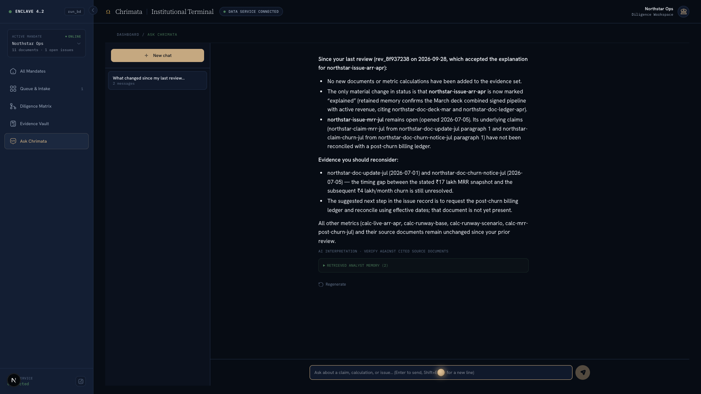

# Hindsight Remembers Why a Diligence Issue Was Resolved

*Draft for review. Screenshots are embedded from the running Chrimata product; replace “we” with your own perspective before publishing if needed.*

A new document can change a number without changing what the analyst already learned about it. If an agent sees only the latest document and the current issue list, a resolved question can look new again. The important context is often the decision: what was accepted, why it was accepted, and what evidence would be enough to revisit it.

We built Chrimata around that problem. It is a financial due diligence workspace where claims, source documents, review decisions, and later changes stay connected. Hindsight gives the review agent a way to retain and recall the reasoning behind earlier decisions, so a later review can start with institutional context instead of treating every change as a blank slate.

## The number is only part of the decision

Consider the fictional company in our sample dataset, Northstar Ops. A March deck reports ₹2.4 crore in annual recurring revenue. An April ledger supports ₹12 lakh in active monthly recurring revenue, or ₹1.44 crore annualized. The rest is not one clean category: ₹5 lakh is signed but not active, and ₹3 lakh is unsigned pipeline. A founder email explains why the deck combined them.

An analyst has to decide what the discrepancy means. That decision depends on the date, the definition of “active,” the underlying records, and the explanation—not just the latest ARR value. If a later update changes MRR, the system should surface the change while preserving the earlier reasoning unless new evidence actually contradicts it.

This is the distinction we wanted memory to preserve. A database can tell us that an issue is resolved. A useful memory can bring back why it was resolved and what would make that conclusion stale.



## Keep arithmetic out of the language model

We draw a hard line between calculations and interpretation. Financial calculations are deterministic backend code using `Decimal`; the language model is not asked to add, subtract, or convert values. The agent receives precomputed metrics, claims, documents, review history, and recalled memory. Its job is to explain relationships, cite evidence, and label uncertainty.

That boundary matters in the Northstar example. The system can report that the ledger supports ₹12 lakh in active MRR and that the annualized figure is ₹1.44 crore because those values come from the calculation layer. It can describe the remaining ₹8 lakh as signed-not-active and unsigned pipeline because those categories are represented in the evidence. It should not quietly turn an inference into a fact.

The agent instructions distinguish “claimed,” “calculated,” “inferred,” and “conditional” values. For example, a July update says ₹17 lakh MRR, while a churn notice removes ₹4 lakh per month. The resulting ₹13 lakh is an inference until the July billing ledger arrives. A separate runway calculation can show a four-month base case and a ten-month scenario only if an unsigned financing term sheet closes. Those conditions belong beside the numbers.

## Store the decision with its context

When an analyst resolves an issue, Chrimata creates a decision receipt. The receipt includes the issue, related claim and definition, the analyst’s decision and explanation, and references to the supporting evidence. The code builds a readable memory from those pieces rather than retaining a bare status flag:

```python
parts = [f"Northstar Ops: {issue.question}"]
if claim:
    parts.append(f"Claim: {claim.original_text} (as of {claim.as_of_date})")
    if claim.definition:
        parts.append(f"Definition: {claim.definition}")
parts.append(f"Analyst decision: {review.decision}")
parts.append(f"Explanation: {review.explanation}")
```

The decision receipt is first persisted in the application database. Chrimata then retains the decision in Hindsight with metadata such as the issue ID, review ID, period, metrics, and decision type. This keeps the operational record and the semantic memory related without making them the same thing. PostgreSQL remains responsible for ticket state and application records; Hindsight supplies contextual recall.

Our adapter uses Hindsight’s async client methods from the FastAPI request loop:

```python
await self.client.aretain(
    bank_id=bank_id,
    document_id=document_id,
    content=text,
    metadata=meta,
)

result = await self.client.arecall(bank_id=bank_id, query=query)
```

The bank ID is scoped by the current run and deal. That keeps one investigation’s recalled context from bleeding into another. For a change review, the memory service assembles a query from the company, changed metrics, issue types, period, and terms such as “prior resolution” and “previous discrepancy.” That is more useful than asking memory to retrieve something from a vague prompt like “analyze this.”



## Recall before deciding what changed

When a new document arrives, the change-review service first computes deterministic differences and identifies candidate issues. It then recalls relevant Hindsight memories and includes the returned text in the context sent to the reasoning step. The model’s response is checked against known document, claim, and issue IDs before a review is stored.

The data flow is intentionally split:

1. The interface sends a request to the FastAPI gateway.
2. The review pipeline compares incoming evidence and identifies affected questions.
3. Hindsight recalls prior decisions and outcomes relevant to those changes.
4. The reasoning step considers the live evidence together with that memory.
5. PostgreSQL stores review and ticket state; a new analyst decision can then be retained for later recall.

The Ask agent follows a related path. It gathers current claims, documents, calculations, issues, and review history, then adds recalled context before generating its answer. The response is expected to cite real source IDs and distinguish evidence from interpretation. Hindsight is a context source here, not a replacement for the documents.



## Compare the review with memory off and on

One useful feature is a replay that runs the same incoming evidence through the review pipeline twice: once with Hindsight recall disabled and once with it enabled. Both runs use `persist=False`, so the comparison does not create another review or retain new memories. Chrimata then computes the differences server-side rather than asking a language model to grade its own output.

```python
without = await service.create_ai_review(
    db, run_id, bank_id, trigger_document_id=document_id,
    memory_enabled=False, persist=False,
)
with_memory = await service.create_ai_review(
    db, run_id, bank_id, trigger_document_id=document_id,
    memory_enabled=True, persist=False,
)
differences = self._compute_differences(without, with_memory)
```

That comparison makes the value of memory inspectable. If memory contains a prior resolution, the review can distinguish a familiar issue from a genuinely new contradiction. The replay can show that one result reopens a question while the other leaves it resolved because the prior decision still applies. The code compares the outputs; it does not claim that every model response will be identical across runs.


## What we learned

**A decision needs provenance.** “Resolved” is too small to be useful on its own. A future reviewer needs the explanation, date, source references, and the conditions that would change the conclusion.

**Memory should add context, not authority.** Hindsight can bring a relevant prior decision into view, but current evidence still determines whether that decision remains valid. The agent’s instructions explicitly allow new contradictory evidence to reopen a resolved question.

**Replay is more persuasive than a memory badge.** Showing the same review with recall disabled and enabled gives a concrete way to inspect what changed. Keeping the comparison non-persistent also avoids polluting the investigation while someone is evaluating it.

**Models should not do bookkeeping arithmetic.** We calculate financial values in ordinary code and ask the model to explain the evidence. The model can still make interpretation mistakes, so outputs remain tied to source records and uncertainty labels.

Chrimata’s central idea is simple: the next review should inherit the useful reasoning from the last one. Hindsight gives us a memory layer for that reasoning, while the evidence store and relational database remain responsible for facts and operational state. That separation is what makes a remembered decision auditable instead of merely familiar.

For more detail, see the [Hindsight GitHub repository](https://github.com/vectorize-io/hindsight), the [Hindsight documentation](https://hindsight.vectorize.io/), and Vectorize’s overview of [agent memory](https://vectorize.io/what-is-agent-memory).
